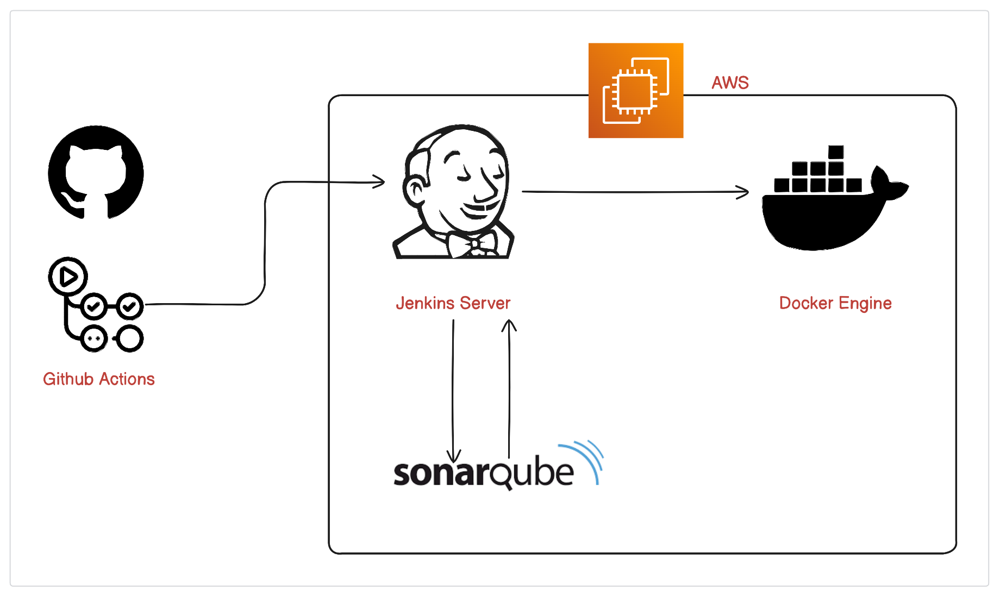

# Streamlining CI/CD with Jenkins: Leveraging SonarQube, Docker, and GitHub Webhooks on AWS

[Blog Post ](https://shumak.hashnode.dev/streamlining-cicd-with-jenkins-leveraging-sonarqube-docker-and-github-webhooks-on-aws)
